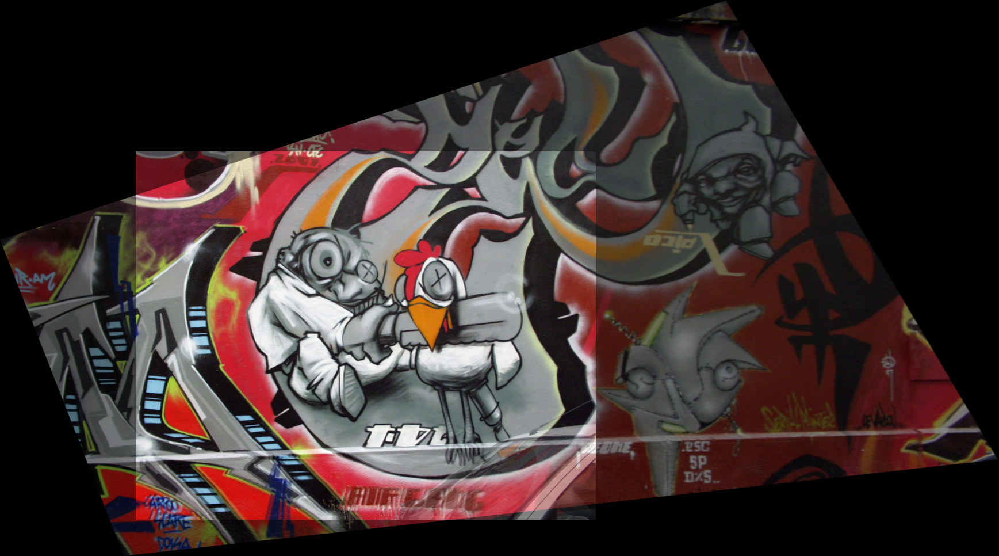

## padded-transformations
Providing a padded version of OpenCV's `warpAffine()` and `warpPerspective()` functions.

## usage
    from padTransf import *
    src_warped, dst_padded = warpPerspectivePadded(src, dst, homography)
    src_warped, dst_padded = warpAffinePadded(src, dst, affine_transf)
    
## files
    test/         contains test images and ground truth homographies; from Oxford's VGG
    .gitignore    self-explanatory
    LICENSE       MIT License statement
    README.md     this file
    example.png   an example image showing the padding extent
    example.py    an example script to show usage and compare with standard OpenCV functions
    padTransf.py  the python module containing the two padded warping functions
    
## functions

Read [my Stack Overflow answer](https://stackoverflow.com/questions/44457064/displaying-stitched-images-together-without-cutoff-using-warpaffine/44459869#44459869) which inspired this repository.

When OpenCV warps an image, any pixels that get warped outside of the bounds of `dsize` are excluded from the resulting warped image. While giving a larger `dsize` can help retain pixels that get mapped to larger pixel locations, you cannot recover the pixel values that get mapped to negative pixel locations. 

The solution requires three steps:
1. Calculate the warped pixel locations manually
2. Add translation to the transformation by however much is necessary in pixels to send all pixels values to positive numbers
3. Pad the destination image to account for the shift and add padding to the edge of the warp

Both `warpAffinePadded` and `warpPerspectivePadded` complete this task using minimal overhead and no user input aside from the same information that would be needed for OpenCV's `warpAffine()` and `warpPerspective()`.

## contribute

Please feel free to submit any suggestions you have or bugs you find via a GitHub issue. Ports to C++ would be lovely if anyone is bored.

## test dataset

The images and ground truth homographies provided in `test/` are from [Oxford's Visual Geometry Group](http://www.robots.ox.ac.uk/~vgg/data5.html).
